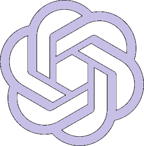
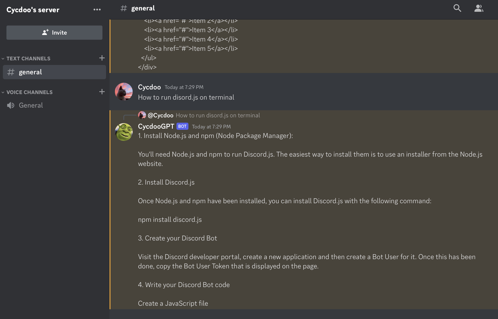

 

  

  <h3 align="center">chatGPT Discord Bot </h3>

  

    ChatGPT Bot is an AI-powered Discord bot designed to generate human-like responses to natural language input.
     
     
  

     

## About The Project

This bot uses Discord Developer Portal and OpenAI API to generate human-like responses to natural language input in a discord server!

## Built With

Node.js
Discord.js
OpenAI

## Getting Started

To get a local copy up and running follow these simple example steps.

### Installation

Get a free OpenAI API Key at [openai.com/api]

Get your Organization Key from[openai.com/api]

Get your Discord Key from the Discord Developer Portal

Replace the keys with your keys in the index.js file

run `npm i discord.js`

run `npm i openai`

## Usage

For more examples, please refer to the Documentation [https://discord.com/developers/docs/intro]

## License

Distributed under the MIT License. See [LICENSE](https://github.com/NoriahM/chatGPT-Discord-Bot/blob/main/LICENSE.md) for more information.

## Authors

* **Noriah M** 

